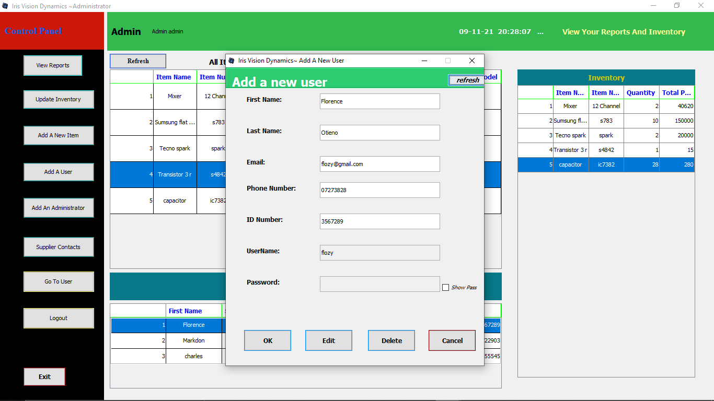
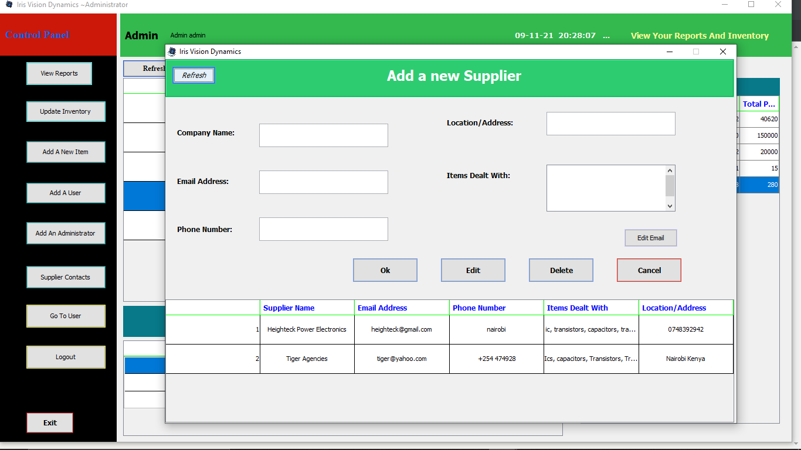
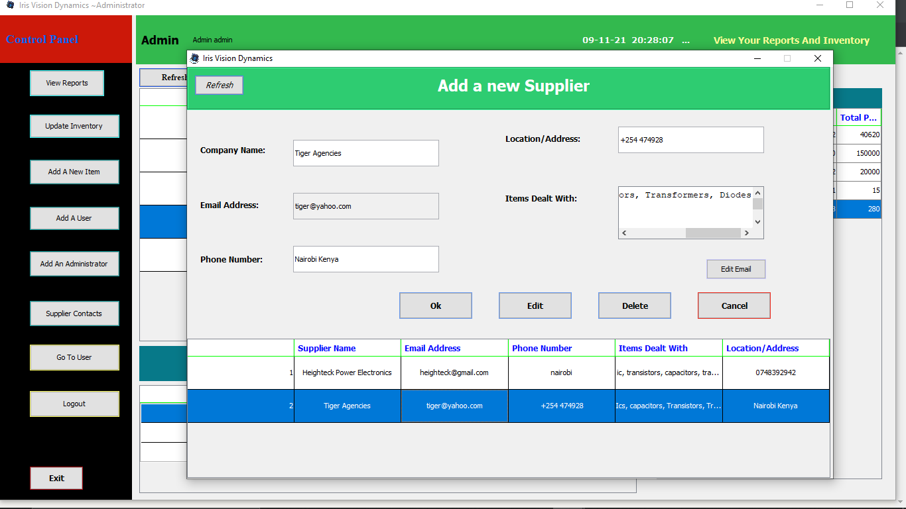

# HILMUS Point of Sale

This is a point of sale application made in Java

Here are the few screenshots for the application at work

## Point Of Sale Section

## Administration Section

## Adding and managing Items

## Add a new User Section

## Add a new Suppliere Section

